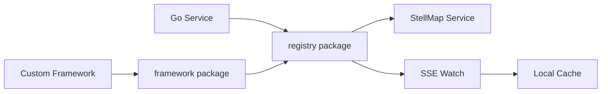

# StellMap Go SDK

面向 Go 微服务的 StellMap 注册中心客户端 SDK，提供服务注册、注销、心跳、实例查询、SSE Watch、自动注册、优雅注销和自研框架生命周期接入能力。

## 项目概述

`stellmap-go-sdk` 是 StellMap 注册中心的 Go 客户端。它面向业务服务、网关、任务调度器和自研框架，提供稳定的注册发现访问能力。

当前仓库按职责拆分为两个核心 package：

- `registry`：公共注册发现客户端，面向业务服务直接使用。
- `framework`：自研业务框架生命周期适配层，面向框架内部集成。

## 当前状态

| 项目 | 说明 |
| --- | --- |
| 稳定性 | 开发中，建议从小规模服务开始接入 |
| 当前建议版本 | v0.1.0 |
| 适用对象 | Go 微服务、自研 Go 框架、网关、控制面组件 |
| 核心协议 | HTTP / SSE |
| 维护方 | StellHub |

## 解决什么问题

- 服务实例注册、注销与心跳续约。
- 查询 StellMap 中的服务实例列表。
- 通过 SSE Watch 感知服务实例变化。
- 支持 `not_leader` 自动重试，降低调用方对注册中心主从状态的感知成本。
- 支持客户端侧参数校验，减少无效注册数据。
- 为自研 Go 框架提供组件化生命周期接入方式。

## 不解决什么问题

- 不提供注册中心服务端内部复制协议。
- 不负责服务端存储、选主和一致性实现。
- 不提供业务鉴权、租户权限或访问控制。
- 不提供完整负载均衡策略，只提供实例数据和事件流。

## 核心能力

| 能力 | 说明 | 典型场景 |
| --- | --- | --- |
| 注册 | 将当前实例注册到 StellMap | 服务启动上线 |
| 注销 | 主动移除当前实例 | 优雅下线 |
| 心跳 | 周期性续约租约 | 实例存活维护 |
| 查询 | 获取服务实例列表 | 客户端发现 |
| Watch | 监听服务实例变化 | 本地缓存更新 |
| 自动重试 | 遇到 `not_leader` 后重试 leader | 注册中心主从切换 |
| 框架适配 | 以 Component 方式接入自研框架 | 统一生命周期管理 |

## 架构说明



业务服务可以直接使用 `registry` 包；自研框架建议通过 `framework` 包封装为组件，统一接入启动、停止、注册、心跳和优雅注销流程。

## 快速开始

### 1. 安装依赖

```bash
go get github.com/stellhub/stellmap-go-sdk
```

### 2. 创建客户端

```go
client, err := registry.NewClient("http://127.0.0.1:8080")
if err != nil {
    log.Fatal(err)
}
```

### 3. 注册实例

```go
err = client.Register(context.Background(), registry.RegisterRequest{
    Namespace:  "prod",
    Service:    "company.trade.order.order-center.api",
    InstanceID: "order-center-api-10.0.1.23",
    Endpoints: []registry.Endpoint{
        {Name: "http", Protocol: "http", Host: "10.0.1.23", Port: 8080},
    },
})
if err != nil {
    log.Fatal(err)
}
```

### 4. 框架组件接入

```go
component, err := framework.NewRegistryComponent(client, provider, options...)
if err != nil {
    log.Fatal(err)
}

app.AddComponent(component)
```

## Package 说明

### registry

`registry` 是业务侧优先使用的包，提供注册、注销、心跳、查询和 Watch 能力。

示例：

- `examples/basic-register/main.go`
- `examples/watch/main.go`
- `examples/auto-registrar/main.go`

### framework

`framework` 面向自研框架接入，核心抽象为：

```go
type Component interface {
    Name() string
    Start(ctx context.Context) error
    Stop(ctx context.Context) error
}
```

推荐模式是：业务服务直接使用 `registry`，自研框架内部封装 `framework`。

## 配置说明

| 配置项 | 是否必填 | 默认值 | 说明 |
| --- | --- | --- | --- |
| serverAddr | 是 | 无 | StellMap 服务端地址 |
| namespace | 是 | prod/default | 命名空间 |
| service | 是 | 无 | 规范化服务名 |
| instanceID | 是 | 无 | 实例唯一标识 |
| leaseTtlSeconds | 否 | SDK 默认值 | 租约 TTL |
| endpoint.weight | 否 | SDK 默认值 | endpoint 权重 |

## 本地开发

```bash
go test ./...
go vet ./...
go build ./...
```

## 测试

涉及注册、心跳、Watch、自动重连和框架生命周期的改动必须补充测试。提交前建议执行：

```bash
go test ./...
```

## 版本与发布

仓库已包含：

- `VERSION`
- `CHANGELOG.md`
- `RELEASE.md`
- `Makefile`

版本号建议遵循语义化版本：

- `MAJOR`：不兼容 API 或行为变更。
- `MINOR`：向后兼容的新能力。
- `PATCH`：向后兼容的问题修复。

## 可观测性

建议业务框架在接入时关注：

| 类型 | 名称 | 说明 |
| --- | --- | --- |
| Log | REGISTER_FAILED | 注册失败 |
| Log | HEARTBEAT_FAILED | 心跳失败 |
| Log | WATCH_RECONNECT | Watch 断线重连 |
| Metric | registry_request_total | 注册中心请求总数 |
| Metric | watch_reconnect_total | Watch 重连次数 |

## 故障排查

### 注册失败

1. 检查 StellMap 服务端地址是否正确。
2. 检查 `namespace/service/instanceID` 是否为空。
3. 检查 endpoint 协议、host、port 是否合法。
4. 如果返回 `not_leader`，确认 leader 地址是否可访问。

### Watch 无事件

1. 检查服务名和命名空间是否匹配。
2. 确认服务端支持 SSE Watch。
3. 检查是否存在网络代理导致长连接中断。
4. 查看重连日志和 sinceRevision 参数。

## 安全说明

- 不要在日志中打印敏感标签、token 或内部拓扑信息。
- 生产环境地址和密钥不要提交到仓库。
- Watch 回调中避免执行长时间阻塞逻辑。

## 目录结构

```text
.
├── registry/       # 注册发现公共客户端
├── framework/      # 自研框架生命周期适配
├── examples/       # 使用示例
├── VERSION         # 当前版本
├── CHANGELOG.md    # 变更记录
├── RELEASE.md      # 发布说明
├── Makefile        # 构建脚本
└── README.md       # 项目说明
```

## 贡献规范

- 公共 API 变更必须说明兼容性影响。
- Watch、重连、心跳相关改动必须补充测试。
- 行为变更必须同步更新 README、CHANGELOG 或 RELEASE 文档。

## 支持

由 StellHub 维护。建议通过 GitHub Issues 记录问题、需求和设计讨论。

## 许可证

以仓库内 `LICENSE` 文件为准。